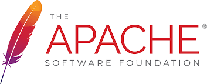
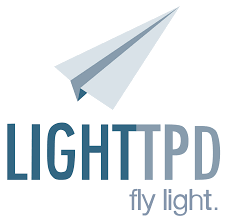
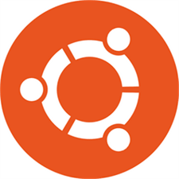

# Deliverable 1 Submission 

## What is a web server?
A web server is a computer system capable of delivering web content to end users over the internet via a web browser

## What are some different web server applications?
* 
The Apache HTTP Server is a free and open-source cross-platform web server software, released under the terms of Apache License 2.0
* 
Nginx is an open source web server that includes reverse proxy, load balancing, mail proxy, and HTTP cache capabilities
* 
Lighttpd is an open-source web server optimized for speed-critical environments while remaining standards-compliant, secure and flexible

## What is virtualization?
Virtualization is the act of creating a virtual version of something at the same abstraction level, including virtual computer hardware platforms, storage devices, and computer network resources

## What is virtualbox?

VirtualBox is a tool for virtualizing x86 and AMD64/Intel64 computing architecture for business and personal use.

## What is a virtual machine?
Virtual machine is the virtualization or emulation of a computer system

## What is Ubuntu Server?

Ubuntu Server is a version of the Ubuntu operating system designed and engineered as a backbone for the internet

## What is a firewall?
Firewall is a network security system that monitors and controls incoming and outgoing network traffic based on predetermined security rules

## What is SSH?
The SSH or Secure Shell Protocol is a cryptographic network protocol for operating network services securely over an unsecured network

