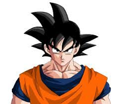
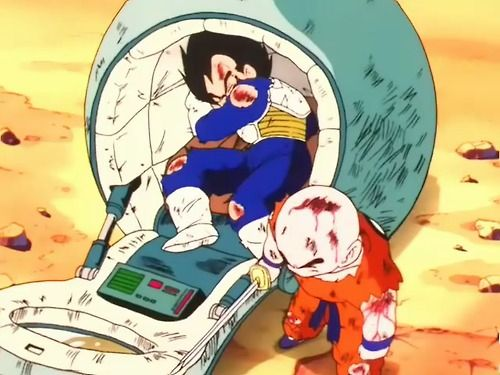
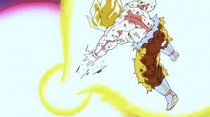

# Goku from Earth

**Protector of the Universe**

HI!! I'm a saiyan who was raised on earth. I spend all my time training, pushing past my limits. I beat down on villains how prey on the innocents. I want to continue to grow stronger and fight lots of strong people all over the universe.

## Experience 
### Defeating my own brother Raditz

After years of peace on earth, some guy claiming to me my brother named Raditz invaded earth and tried to take my son away. It took the combined efforts of me and my old enemy Demon King Piccolo to finally defeat Raditz. But at the cost of my own life. Luckily, Earth has these things called the dragon balls that can grant any wish, which Bulma and the others collected them to wish me back.

### Defeating Vegeta, Prince of all Saiyans

After Raditz was defeated, he told us that two more saiyans, who are even stronger than him, would be coming to Earth in one years time. I trained like crazy in the other world on king kais planet. I was able to defeat one of them called Nappa with relative ease, but the one called Vegeta was incredibly strong. No matter what I did, he would always one up me. If Krillin, Gohan and even Yajirobe weren't there, I would've definitely been a goner.

### Defeating Frieza on Planet Namek

On my way to Planet Namek King Kai kept warning me not to fight Frieza, saying he was way to strong, and man was he right. Even after all the training I did and even after the zenkai boost I got from getting healed in the healing chamber, he was still way stronger than me. It took my best friend Krillin dying in front of me too finally gain the power I needed to finally defeat him. 

## Education
### Turtle School

### King Kais Planet

### Beeru's Planet

## Projects
### Training to be the strongest 
Im always training to be the strongest. New enemies keep on popping up, always stronger than the last. If I want to take them on I need to keep training.

### Trying to be a better father.....trying.....
Because I'm always training, I haven't really had enough time to bond with my sons, especially Goten. But Piccolos still on earth so they have hi if they need anything 

## Skills
### Martial Arts
I've been training in martial arts ever since my Grandpa Gohan found me when I was a baby. And I've improving it ever since

### Kamehameha
I learned this technique after watching Master Roshi do it when I was a kid. I focus ki to where my hands are and then unleash it in a big energy wave

### Spirit Bomb
This move I learned from King Kai. I take in energy from stuff like animals, plants, the sun, et. and turn it all into a big ball of energy. The longer I take in energy, the stronger it is.

## Associations
### Our farm
Chi-Chi was getting really mad at me because all I do is train. She wanted me to go out and start making money for the family. So she made me harvest all of our crops, and even made Piccolo help out. But once Mr. Hercule dropped off a ton of prize money, she let me go train.

