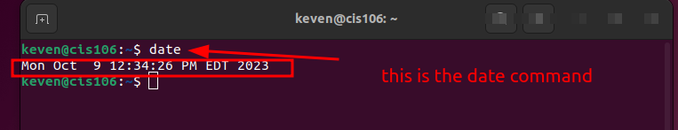
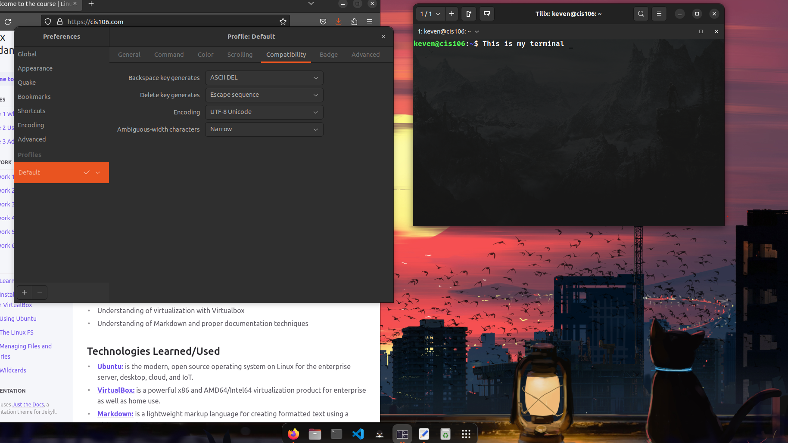
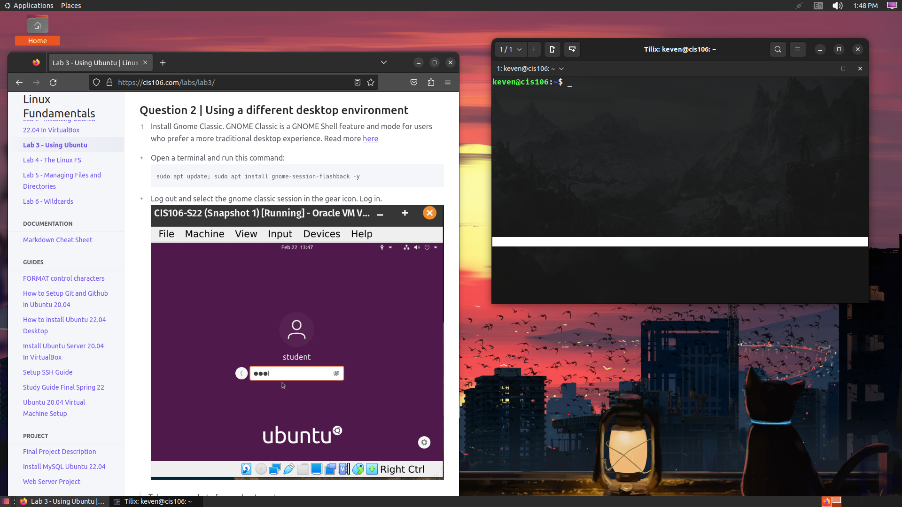

# Lab 3 Submission 

## Q1
 
 

## Q2

## Q3
| Program purpose     | Package Name     | Version            |
| ------------------- | ---------------- | ------------------ |
| Play a tetris game  | blockattack      | 2.7.0-1            |
| Play a video file   | dragonplayer     | 4:21.12.3-Oubuntu1 |
| Browse the internet | epiphany-browser | 42.4-Oubuntu1      |
| Read your email     | gnome-gmail      | 2.9-3              |
| Play music          | lxmusic          | 0.4.7-1.1          |

## Q4

| command | what it does                                                            |
| ------- | ----------------------------------------------------------------------- |
| echo    | echo - display a line of text                                           |
| fortune | fortune - print a random, hopefully  interesting, adage                 |
| cowsay  | cowsay/cowthink - configurable speaking/thinking cow (and a bit more)   |
| lolcat  | lolcat - rainbow coloring effect for text console display               |
| figlet  | FIGlet - display large characters made up of ordinary screen characters |
| toilet  | TOIlet - display large colourful characters                             |
| rig     | RIG - Random Identity Generator                                         |