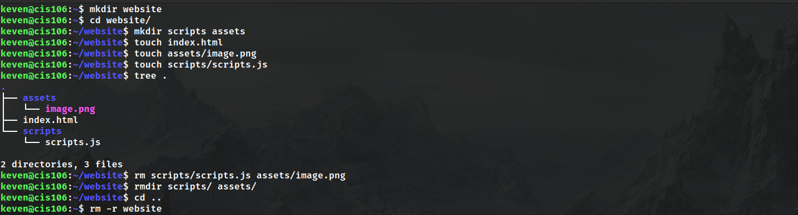
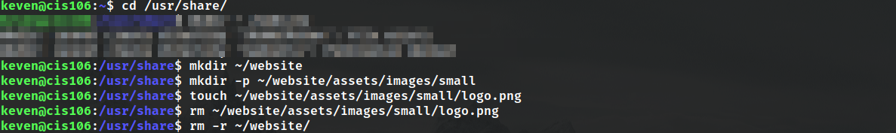
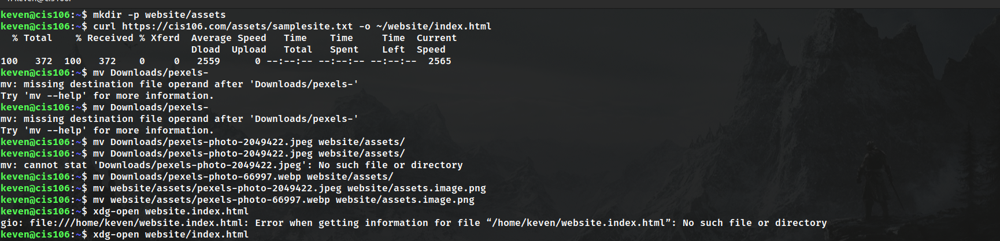

# Week Report 5

## Answers to question 

* **What are Command Options?**
  commands used to pass parameters to a program
* **What are Command Arguments?**
  arguments that are indicated after the name of the program in the framework's order line
* **Which command is used for creating directories? Provide at least 3 examples.**
  mkdir command
   *mkdir lab5A
   *mkdir lab5B
   *mkdir lab5C
* **What does the touch command do? Provide at least 3 examples.**
 updates the access and modification times of each file specified by the File parameter of each directory specified by the Directory parameter
   *Downloads touch picture
   *touch pets/old/file1
   *touch pets/new/file3
* **How do you remove a file? Provide an example.**
  rm command 
   * rm /home/keven/lab5/pets
* **How do you remove a directory and can you remove non-empty directories in Linux? Provide an example**
  rm and you can remove a none-empty directory with rm -r
   * rm -r ~/lab5/pets/
* **Explain the mv and cp command. Provide at least 2 examples of each**
  mv deletes the source file or directory after moving it
   * mv Downloads/pet
  cp keeps the source file or directory intact
   * cp Download/pet

## Practice 1 

## Practice 2

## Practice 3 
