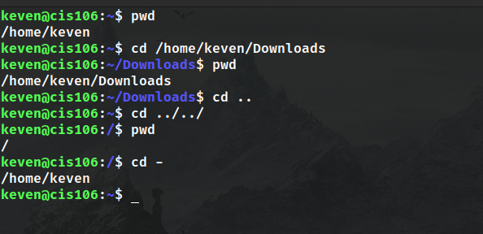
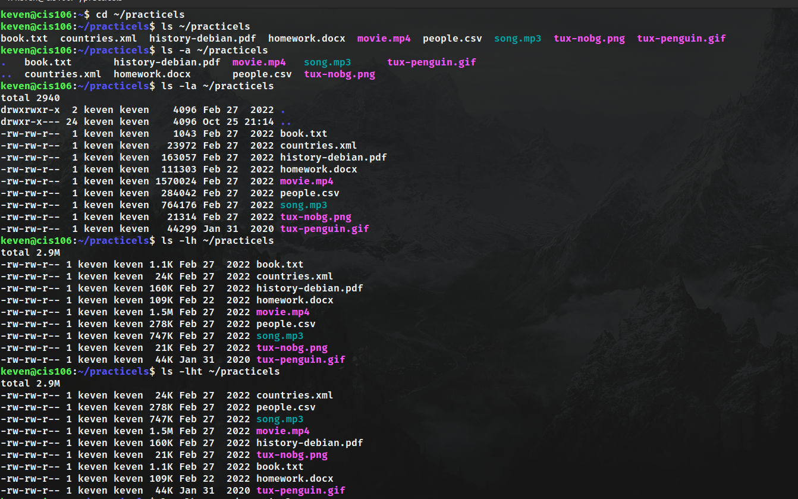
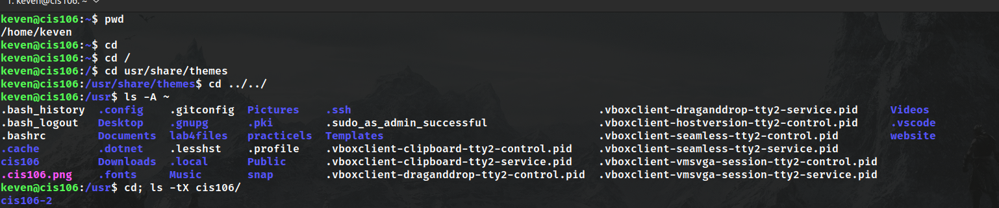
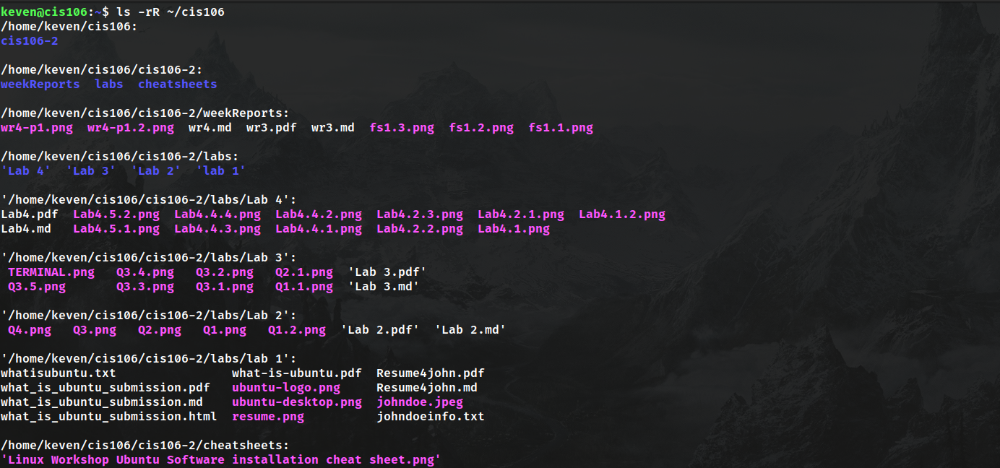
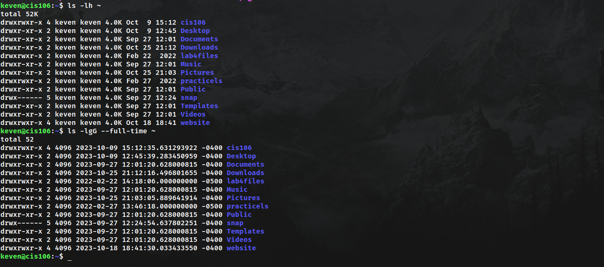
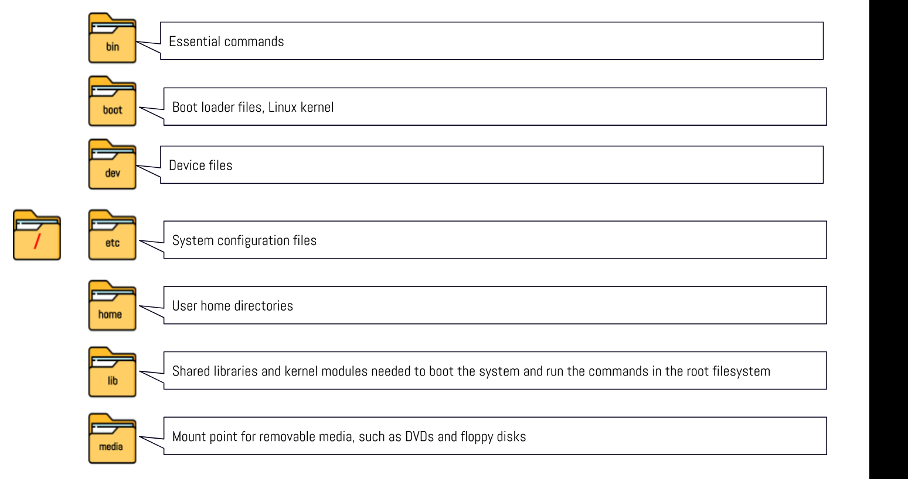
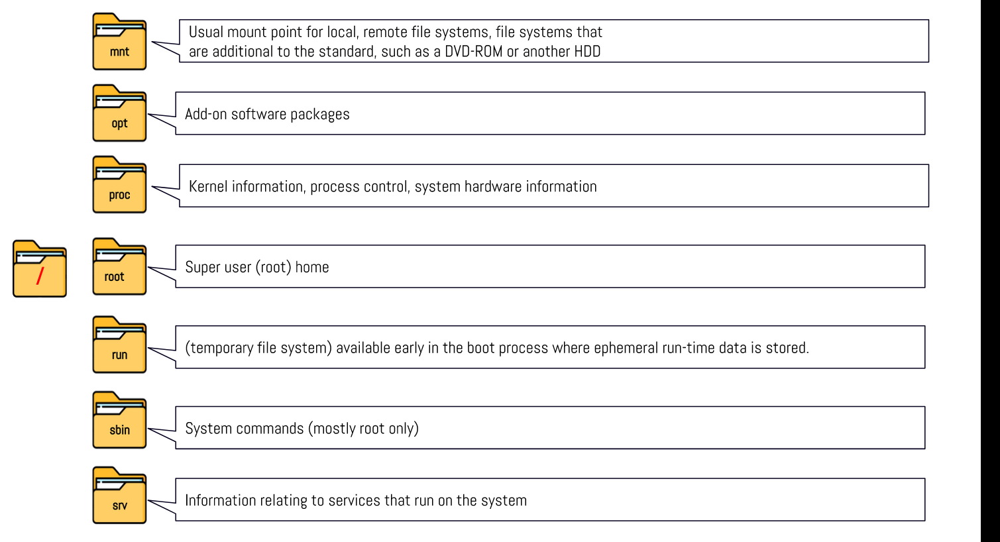
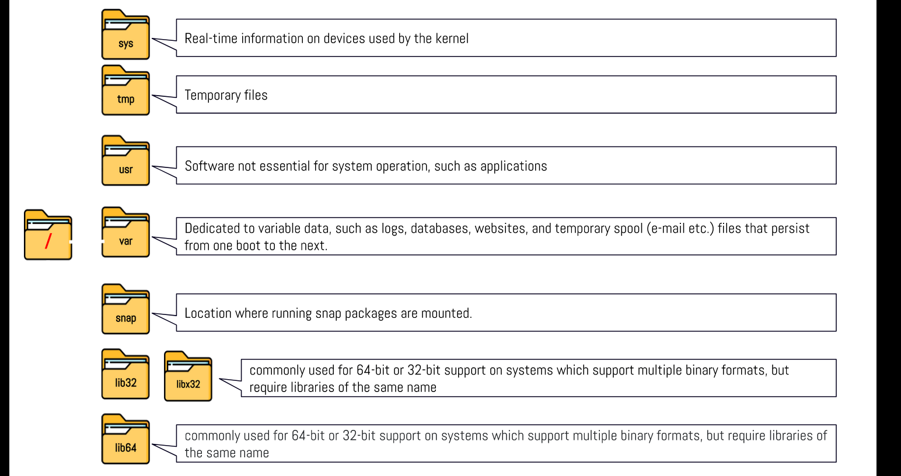

# Week Report 4

## PRACTICE FROM THE PRESENTATION THE LINUX FILE SYSTEM:
### Practice 1

### Practice 2

### Practice 3

## THE LINUX FILE SYSTEM DIRECTORIES AND THEIR PURPOSE:

## ALL THE COMMANDS FOR NAVIGATING THE FILESYSTEM

| Command | What it does                           | Syntax | Example         |
| ------- | -------------------------------------- | ------ | --------------- |
| pwd     | prints current directory               | pwd    | 'pwd'           |
| cd      | allows you to move between directories | cd     | 'cd Documents/' |
| ls      | list files                             | ls     | ls Downloads/   |

## Basic terminology

* **File system**
  a set of processes that controls how, where and when data is stored and retrieved from a storage device
* **Current directory**
  the directory where all the commands are being executed
* **parent directory**
  The directory containing the current directory
* **the difference between YOUR HOME directory and THE HOME directory**
  the parent directory is the directory above the current directory, the home directory is the default directory for a user
* **pathname**
  the specifying the location of a file or directory from the root directory
* **relative path**
  path related to the present working directory
* **absolute path**
 the specifying the location of a file or directory from the root directory