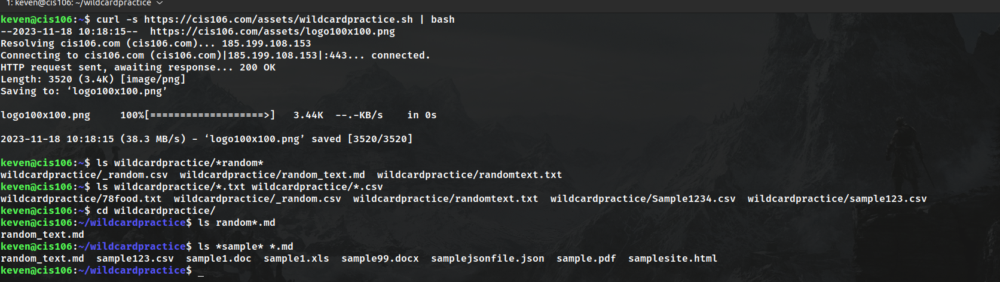
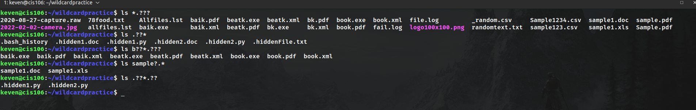

# Week Report 6

## Wildcards 
Wildcard represents letters and characters used to specify a file name for searches 

### * Wildcards
the * wildcard matches from 0 to any number of characters
* Examples:
  * List all the text file in a directory
    * 'ls *.txt'
  * List all the files that start with the word file
    * 'ls file*'
  * Copy all the mp4 files
    * 'cp Downloads/*.mp4 ~/Videos/Movies/'
  
### ? Wildcards
The ? wildcard matches a single character
*Example:
  *list all the files that have 3 characters and are followed by the word file in the name
    * ls ???File*
  *list all the files that have 2 characters and are followed by the word card in the name
    * ls ??card*
  *list all the files that have 4 characters and are followed by the word wild in the name
    * ls ????wild*
  
### [] Wildcards
The [] matches a single character in a range
*Example
  * to match all the files that have a vowel after f
    * ls f[aeiou]*
  * to match all files that do not have a vowel after letter f
    * ls f[!aeiou]*
  * to macth all files that have a range of letters after f
    * ls f[a-z]*

### Brace Expansion 
Brace expansion {} is not a wildcard but another feature of bash that allows you to generate arbitrary strings to use with commands 
  * to create a whole directory structure in a single command 
    * mkdir -p music/{jazz,rock}/{mp3files,videos,oggfiles}/new{1..3}
  * to create a N number of files use 
    * touch website{1..5}.html
  *remove multiple files in a single directory 
    * rm -r {dir1,dir2,dir3,file.txt,file.py}
  
## Practice 

### Practice 5 

### Practice 6

### Practice 7
